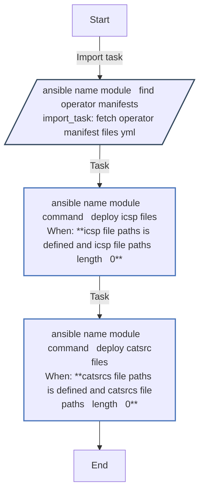
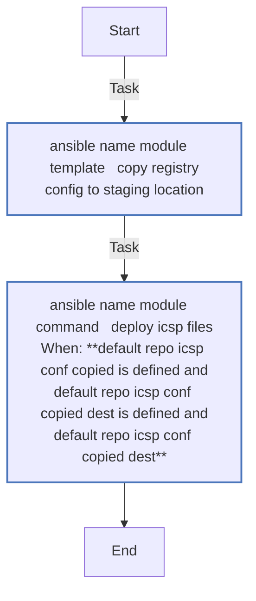

<!-- DOCSIBLE START -->

# 📃 Role overview

## cluster_post-install_day_two


Description: Not available.

| Field                | Value           |
|--------------------- |-----------------|
| Readme update        | 13/03/2025 |


### Tasks


#### File: tasks/process-operator-catalogs-and-icsp.yml

| Name | Module | Has Conditions |
| ---- | ------ | --------- |
| {{ ansible_name_module }} ¦ Find operator manifests | import_tasks | False |
| {{ ansible_name_module }} ¦ command ¦ deploy ICSP files | command | True |
| {{ ansible_name_module }} ¦ command ¦ deploy CATSRC files | command | True |

#### File: tasks/fetch-operator-manifest-files.yml

| Name | Module | Has Conditions |
| ---- | ------ | --------- |
| {{ ansible_name_module }} ¦ set ¦  all ISCP files path | set_fact | True |
| {{ ansible_name_module }} ¦ set ¦  all CatalogSource files path | set_fact | True |
| {{ ansible_name_module }} ¦ find ¦  Find all ISCP files | find | False |
| {{ ansible_name_module }} ¦ find ¦  Find all CatalogSource files | find | False |
| {{ ansible_name_module }} ¦ set_fact ¦ ICSP file paths | set_fact | True |
| {{ ansible_name_module }} ¦ set_fact ¦ CatSrc file paths | set_fact | True |

#### File: tasks/process-default-repository-icsp.yml

| Name | Module | Has Conditions |
| ---- | ------ | --------- |
| {{ ansible_name_module }} ¦ template ¦ Copy registry config to staging location | template | False |
| {{ ansible_name_module }} ¦ command ¦ deploy ICSP files | command | True |


## Task Flow Graphs


### Graph for process-operator-catalogs-and-icsp.yml




### Graph for fetch-operator-manifest-files.yml

```mermaid
flowchart TD
Start
classDef block stroke:#3498db,stroke-width:2px;
classDef task stroke:#4b76bb,stroke-width:2px;
classDef includeTasks stroke:#16a085,stroke-width:2px;
classDef importTasks stroke:#34495e,stroke-width:2px;
classDef includeRole stroke:#2980b9,stroke-width:2px;
classDef importRole stroke:#699ba7,stroke-width:2px;
classDef includeVars stroke:#8e44ad,stroke-width:2px;
classDef rescue stroke:#665352,stroke-width:2px;

  Start-->|Task| ansible_name_module___set____all_ISCP_files_path0[ansible name module   set    all iscp files path<br>When: **not icsp manifests path is defined or icsp<br>manifests path**]:::task
  ansible_name_module___set____all_ISCP_files_path0-->|Task| ansible_name_module___set____all_CatalogSource_files_path1[ansible name module   set    all catalogsource<br>files path<br>When: **not catsrcs manifests path is defined or catsrcs<br>manifests path**]:::task
  ansible_name_module___set____all_CatalogSource_files_path1-->|Task| ansible_name_module___find____Find_all_ISCP_files2[ansible name module   find    find all iscp files]:::task
  ansible_name_module___find____Find_all_ISCP_files2-->|Task| ansible_name_module___find____Find_all_CatalogSource_files3[ansible name module   find    find all<br>catalogsource files]:::task
  ansible_name_module___find____Find_all_CatalogSource_files3-->|Task| ansible_name_module___set_fact___ICSP_file_paths4[ansible name module   set fact   icsp file paths<br>When: **icsp manifests is defined and icsp manifests files<br>is defined and icsp manifests files   length   0**]:::task
  ansible_name_module___set_fact___ICSP_file_paths4-->|Task| ansible_name_module___set_fact___CatSrc_file_paths5[ansible name module   set fact   catsrc file paths<br>When: **catsrcs manifests is defined and catsrcs manifests<br>files is defined and catsrcs manifests files  <br>length   0**]:::task
  ansible_name_module___set_fact___CatSrc_file_paths5-->End
```




### Graph for process-default-repository-icsp.yml




## Playbook

```yml
- name: ' Konductor | Provision UPI Infra | post-deploy-cluster-status-check.yml'
  hosts: localhost
  become: yes
  vars:
    ansible_python_interpreter: /usr/bin/python3
    module: "cluster-status-check"
    ansible_name_module: " Post Cluster Installation | Check components status | {{ module }}"
  vars_files:
    - '../vars/vault.yml'
    - '../vars/common.yml'

  pre_tasks:
    - name: '{{ ansible_name_module }} | {{ openshift_cli }} whoami | check if there is valid session'
      command: >
        {{ openshift_cli }} whoami
      ignore_errors: yes
      register: existing_session

    - name: '{{ ansible_name_module }} | import_tasks | Conditional import of ocp-cluster-login role'
      import_tasks: ../roles/ocp-cluster-login/tasks/main.yml
      when:
        - existing_session.rc > 0

  tasks:
    - name: '{{ ansible_name_module }} | command | Get clusteroperators'
      shell: >
        {{ openshift_cli }} get co --no-headers | awk '{print $1}'
      register: cluster_operators

    - name: '{{ ansible_name_module }} | command | Get clusteroperator status'
      shell: >
        {{ openshift_cli }} get co {{ item }} -o jsonpath='{.status.conditions[*]}{"\n"}' \
        | jq ' . | select(.type=="Available") | select(.status=="False")' | wc -l
      loop: "{{ cluster_operators.stdout_lines }}"
      when:
        - cluster_operators.rc is defined
        - cluster_operators.rc == 0
        - cluster_operators.stdout_lines is defined
        - cluster_operators.stdout_lines | length > 0 
      register: cluster_operator_statuses

    - name: '{{ ansible_name_module }} | command | Get cluster nodes'
      shell: >
        {{ openshift_cli }} get nodes --no-headers | awk '{print $1}'
      register: cluster_nodes

    - name: '{{ ansible_name_module }} | command | Get cluster nodes ready status'
      shell: >
        {{ openshift_cli }} get node {{ item }}  -o jsonpath='{.status.conditions[*]}{"\n"}' | grep -v Ready | wc -l 
      loop: "{{ cluster_nodes.stdout_lines }}"
      when:
        - cluster_nodes.rc is defined
        - cluster_nodes.rc == 0
        - cluster_nodes.stdout_lines is defined
        - cluster_nodes.stdout_lines | length > 0 
      register: cluster_node_statuses

    - name: '{{ ansible_name_module }} | command | Get cluster networking failing pods 1 of 4'
      shell: >
        {{ openshift_cli }} get pods -n openshift-sdn --no-headers | grep -vi running | wc -l 
      register: cluster_failing_pods_sdn

    - name: '{{ ansible_name_module }} | command | Get cluster networking failing pods 2 of 4'
      shell: >
        {{ openshift_cli }} get pods -n openshift-network-operator --no-headers | grep -vi running | wc -l 
      register: cluster_failing_pods_network

    - name: '{{ ansible_name_module }} | command | Get cluster networking failing pods 3 of 4'
      shell: >
        {{ openshift_cli }} get pods -n openshift-dns --no-headers | grep -vi running | wc -l 
      register: cluster_failing_pods_dns

    - name: '{{ ansible_name_module }} | command | Get cluster networking failing pods 4 of 4'
      shell: >
        {{ openshift_cli }} get pods -n openshift-dns-operator --no-headers | grep -vi running | wc -l 
      register: cluster_failing_pods_dnsoperator

    - name: '{{ ansible_name_module }} | command | Get cluster ingress status 1 of 3'
      shell: >
        {{ openshift_cli }} get pods -n openshift-ingress-canary --no-headers | grep -vi running | wc -l
      register: cluster_failing_pods_ingresscanary

    - name: '{{ ansible_name_module }} | command | Get cluster ingress status 2 of 3'
      shell: >
        {{ openshift_cli }} get pods -n openshift-ingress --no-headers | grep -vi running | wc -l
      register: cluster_failing_pods_ingress

    - name: '{{ ansible_name_module }} | command | Get cluster ingress status 3 of 3'
      shell: >
        {{ openshift_cli }} get pods -n openshift-ingress-operator | grep -vi running | wc -l
      register: cluster_failing_pods_ingressoperator

    - name: '{{ ansible_name_module }} | command | Get cluster canary ingress route'
      command: >
        {{ openshift_cli }} get route canary -n openshift-ingress-canary -ojsonpath='{.spec.host}{"\n"}'
      register: cluster_route_canary

    - name: '{{ ansible_name_module }} | command | Get cluster default ingress load balancer service 1 of 2'
      command: >
        {{ openshift_cli }} get svc router-default -n openshift-ingress -o jsonpath='{.status.loadBalancer.ingress[0].hostname}{"\n"}'  
      register: cluster_default_router_ingress
  
    - name: '{{ ansible_name_module }} | command | Get cluster default ingress load balancer service 2 of 2'
      shell: >
        nslookup {{ cluster_default_router_ingress.stdout }}
      when:
        - cluster_default_router_ingress.rc is defined
        - cluster_default_router_ingress.rc == 0
        - cluster_default_router_ingress.stdout is defined
        - cluster_default_router_ingress.stdout != ''
      register: cluster_default_router_ingress_instances
  
    - name: '{{ ansible_name_module }} | command | Get cluster default storage class status'
      shell: >
        {{ openshift_cli }} get sc  --no-headers |  wc -l
      register: cluster_sc

    - name: '{{ ansible_name_module }} | command | Get cluster image registry failing pods'
      shell: >
        {{ openshift_cli }} get pods -n openshift-image-registry --no-headers | egrep -vi "running|complete" | wc -l  
      register: cluster_failing_pods_registry

    - name: '{{ ansible_name_module }} | command | Get cluster web console URL'
      shell: >
        {{ openshift_cli }} whoami --show-console 
      register: cluster_console_url

    - name: '{{ ansible_name_module }} | command | Get cluster API URL'
      shell: >
        {{ openshift_cli }} whoami --show-server
      register: cluster_api_url

    - name: '{{ ansible_name_module }} | command | Verify Cluster Web Console access and output 1 of 2'
      shell: >
        curl -k -o /dev/null  -s -w "%{http_code}\n" {{ cluster_console_url.stdout }}
      when:
        - cluster_console_url.rc is defined
        - cluster_console_url.rc == 0
        - cluster_console_url.stdout is defined
        - cluster_console_url.stdout != ''
      register: cluster_console_url_test

    - name: '{{ ansible_name_module }} | command | verify Cluster Web Console access and output 2 of 2'
      shell: >
        curl -k {{ cluster_console_url.stdout }} | grep openshift
      when:
        - cluster_console_url.rc is defined
        - cluster_console_url.rc == 0
        - cluster_console_url.stdout is defined
        - cluster_console_url.stdout != ''
      register: cluster_console_url_test_output

    - name: '{{ ansible_name_module }} | Retrieve Infrastructure ID'
      command: >
        {{ openshift_cli }} get -o jsonpath='{.status.infrastructureName}{"\n"}' \
           infrastructure cluster
      register: cluster_infra_id

    - name: '{{ ansible_name_module }} | Create Test Validation Application Namespace'
      command: >
        {{ openshift_cli }} new-project '{{ cluster_infra_id.stdout }}-cluster-validation-project' \
          --display-name='{{ cluster_infra_id.stdout }}-cluster-validation-project' \
          --description='{{ cluster_infra_id.stdout }}-cluster-validation-project'
      failed_when: "cluster_validation_ns_created.rc >=1 and not ' already exists' in cluster_validation_ns_created.stderr"
      register: cluster_validation_ns_created

    - name: '{{ ansible_name_module }} | command | Get cluster Logging status if applicable 1 of 3'
      shell: >
        {{ openshift_cli }} get project openshift-logging --no-headers | awk '{print $1}'
      ignore_errors: yes
      register: cluster_logging_ns_checked

    - name: '{{ ansible_name_module }} | command | Get cluster Logging status if applicable 2 of 3'
      shell: >
        {{ openshift_cli }} get pods -n openshift-logging --no-headers | egrep -vi "running|complete" | wc -l
      when:
        - cluster_logging_ns_checked.rc is defined
        - cluster_logging_ns_checked.rc == 0 
        - cluster_logging_ns_checked.stdout is defined
        - cluster_logging_ns_checked.stdout != ''
      register: cluster_failing_pods_logging

    - name: '{{ ansible_name_module }} | command | Get cluster Logging status if applicable 3 of 3'
      shell: >
        {{ openshift_cli }} get  route kibana -n openshift-logging --no-headers -o jsonpath='{.spec.host}{"\n"}' 
      when:
        - cluster_failing_pods_logging is defined
        - cluster_failing_pods_logging.rc is defined
        - cluster_failing_pods_logging.rc == 0 
        - cluster_failing_pods_logging.stdout is defined
        - " '0' in cluster_failing_pods_logging.stdout" 
      register: cluster_kibana_route

    - name: '{{ ansible_name_module }} | command | Verify Cluster Kibana Consolo access '
      shell: >
        curl -k -o /dev/null  -s -w "%{http_code}\n" "https://{{ cluster_kibana_route.stdout }}"
      when:
        - cluster_kibana_route.rc is defined
        - cluster_kibana_route.rc == 0
        - cluster_kibana_route.stdout is defined
        - cluster_kibana_route.stdout != ''
      register: cluster_kibana_console_url_test

    - name: '{{ ansible_name_module }} | command | Get cluster Monitoring status if applicable 1 of 3'
      shell: >
        {{ openshift_cli }} get project openshift-monitoring --no-headers | awk '{print $1}'
      ignore_errors: yes
      register: cluster_monitoring_ns_checked

    - name: '{{ ansible_name_module }} | command | Get cluster Monitoring status if applicable 2 of 3'
      shell: >
        {{ openshift_cli }} get pods -n openshift-monitoring --no-headers | egrep -vi "running|complete" | wc -l
      when:
        - cluster_monitoring_ns_checked.rc is defined
        - cluster_monitoring_ns_checked.rc == 0 
        - cluster_monitoring_ns_checked.stdout is defined
        - cluster_monitoring_ns_checked.stdout != ''
      register: cluster_failing_pods_monitoring

    - name: '{{ ansible_name_module }} | command | Get cluster Monitoring status if applicable 3 of 3'
      shell: >
        {{ openshift_cli }} get route grafana -n openshift-monitoring --no-headers -o jsonpath='{.spec.host}{"\n"}' 
      when:
        - cluster_failing_pods_monitoring is defined
        - cluster_failing_pods_monitoring.rc is defined
        - cluster_failing_pods_monitoring.rc == 0 
        - cluster_failing_pods_monitoring.stdout is defined
        - " '0' in cluster_failing_pods_monitoring.stdout" 
      register: cluster_grafana_route

    - name: '{{ ansible_name_module }} | command | Verify Cluster grafana Consolo access '
      shell: >
        curl -k -o /dev/null  -s -w "%{http_code}\n" "https://{{ cluster_grafana_route.stdout }}"
      when:
        - cluster_grafana_route.rc is defined
        - cluster_grafana_route.rc == 0
        - cluster_grafana_route.stdout is defined
        - cluster_grafana_route.stdout != ''
      register: cluster_grafana_console_url_test

    - name: '{{ ansible_name_module }} | set  Validation Test Application image tag if required '
      set_fact:
        validation_app_image_name_tag: "{{ ':' + validation_app_image_tag if validation_app_image_tag is defined and validation_app_image_tag != '' else '' }}"

    - name: '{{ ansible_name_module }} | Deploy Validation Test Application Namespace'
      command: >
        {{ openshift_cli }} new-app {{ registry_host_fqdn }}/{{ local_repository }}/{{ validation_app_image }}{{ validation_app_image_name_tag }} -n '{{ cluster_infra_id.stdout }}-cluster-validation-project' 
      when:
        - deploy_test_app is defined
        - deploy_test_app | bool
        - validation_app_image is defined 
        - validation_app_image != ''  
      register: cluster_validation_app_deployed

    - name: '{{ ansible_name_module }} | Print Cluster Check Results 0 of 26 '
      vars:
        header: |
             "###################################################################################"
             "###################################################################################"
             "######################    Cluster Deployment Status Check Results   ###############"
             "###################################################################################"
             "###################################################################################"
      debug:
        msg: "{{ header.split('\n') }}"

    - name: '{{ ansible_name_module }} | Print Cluster Check Results 1 of 26 '
      debug:
        var: cluster_operator_statuses 

    - name: '{{ ansible_name_module }} | Print Cluster separator '
      vars:
        sep_strg: "\n\n"
      debug:
        var: sep_strg

    - name: '{{ ansible_name_module }} | Print Cluster Check Results 2 of 26 '
      debug:
        var: cluster_node_statuses

    - name: '{{ ansible_name_module }} | Print Cluster separator '
      vars:
        sep_strg: "\n\n"
      debug:
        var: sep_strg

    - name: '{{ ansible_name_module }} | Print Cluster Check Results 3 of 26 '
      debug:
        var: cluster_failing_pods_sdn

    - name: '{{ ansible_name_module }} | Print Cluster separator '
      vars:
        sep_strg: "\n\n"
      debug:
        var: sep_strg

    - name: '{{ ansible_name_module }} | Print Cluster Check Results 4 of 26 '
      debug:
        var: cluster_failing_pods_network

    - name: '{{ ansible_name_module }} | Print Cluster separator '
      vars:
        sep_strg: "\n\n"
      debug:
        var: sep_strg

    - name: '{{ ansible_name_module }} | Print Cluster Check Results 5 of 26 '
      debug:
        var: cluster_failing_pods_dns

    - name: '{{ ansible_name_module }} | Print Cluster separator '
      vars:
        sep_strg: "\n\n"
      debug:
        var: sep_strg

    - name: '{{ ansible_name_module }} | Print Cluster Check Results 6 of 26 '
      debug:
        var: cluster_failing_pods_dnsoperator

    - name: '{{ ansible_name_module }} | Print Cluster separator '
      vars:
        sep_strg: "\n\n"
      debug:
        var: sep_strg

    - name: '{{ ansible_name_module }} | Print Cluster Check Results 7 of 26 '
      debug:
        var: cluster_failing_pods_ingresscanary

    - name: '{{ ansible_name_module }} | Print Cluster separator '
      vars:
        sep_strg: "\n\n"
      debug:
        var: sep_strg

    - name: '{{ ansible_name_module }} | Print Cluster Check Results 8 of 26 '
      debug:
        var: cluster_route_canary

    - name: '{{ ansible_name_module }} | Print Cluster separator '
      vars:
        sep_strg: "\n\n"
      debug:
        var: sep_strg

    - name: '{{ ansible_name_module }} | Print Cluster Check Results 9 of 26 '
      debug:
        var: cluster_default_router_ingress

    - name: '{{ ansible_name_module }} | Print Cluster separator '
      vars:
        sep_strg: "\n\n"
      debug:
        var: sep_strg

    - name: '{{ ansible_name_module }} | Print Cluster Check Results 10  of 26 '
      debug:
        var: cluster_default_router_ingress_instances

    - name: '{{ ansible_name_module }} | Print Cluster separator '
      vars:
        sep_strg: "\n\n"
      debug:
        var: sep_strg

    - name: '{{ ansible_name_module }} | Print Cluster Check Results 11 of 26 '
      debug:
        var: cluster_sc

    - name: '{{ ansible_name_module }} | Print Cluster separator '
      vars:
        sep_strg: "\n\n"
      debug:
        var: sep_strg

    - name: '{{ ansible_name_module }} | Print Cluster Check Results 12 of 26 '
      debug:
        var: cluster_failing_pods_registry

    - name: '{{ ansible_name_module }} | Print Cluster separator '
      vars:
        sep_strg: "\n\n"
      debug:
        var: sep_strg

    - name: '{{ ansible_name_module }} | Print Cluster Check Results 13 of 26 '
      debug:
        var: cluster_console_url

    - name: '{{ ansible_name_module }} | Print Cluster separator '
      vars:
        sep_strg: "\n\n"
      debug:
        var: sep_strg

    - name: '{{ ansible_name_module }} | Print Cluster Check Results 14 of 26 '
      debug:
        var: cluster_api_url

    - name: '{{ ansible_name_module }} | Print Cluster separator '
      vars:
        sep_strg: "\n\n"
      debug:
        var: sep_strg

    - name: '{{ ansible_name_module }} | Print Cluster Check Results 15 of 26 '
      debug:
        var: cluster_console_url_test

    - name: '{{ ansible_name_module }} | Print Cluster separator '
      vars:
        sep_strg: "\n\n"
      debug:
        var: sep_strg

    - name: '{{ ansible_name_module }} | Print Cluster Check Results 16 of 26 '
      debug:
        var: cluster_console_url_test_output

    - name: '{{ ansible_name_module }} | Print Cluster separator '
      vars:
        sep_strg: "\n\n"
      debug:
        var: sep_strg

    - name: '{{ ansible_name_module }} | Print Cluster Check Results 17 of 26 '
      debug:
        var: cluster_infra_id

    - name: '{{ ansible_name_module }} | Print Cluster separator '
      vars:
        sep_strg: "\n\n"
      debug:
        var: sep_strg

    - name: '{{ ansible_name_module }} | Print Cluster Check Results 18 of 26 '
      debug:
        var: cluster_validation_ns_created

    - name: '{{ ansible_name_module }} | Print Cluster separator '
      vars:
        sep_strg: "\n\n"
      debug:
        var: sep_strg

    - name: '{{ ansible_name_module }} | Print Cluster Check Results 19 of 26 '
      debug:
        var: cluster_validation_app_deployed 
      when:
        - cluster_validation_app_deployed is defined

    - name: '{{ ansible_name_module }} | Print Cluster separator '
      vars:
        sep_strg: "\n\n"
      debug:
        var: sep_strg

    - name: '{{ ansible_name_module }} | Print Cluster Check Results 20 of 26 '
      debug:
        var: cluster_logging_ns_checked
      when:
        - cluster_logging_ns_checked is defined

    - name: '{{ ansible_name_module }} | Print Cluster separator '
      vars:
        sep_strg: "\n\n"
      debug:
        var: sep_strg

    - name: '{{ ansible_name_module }} | Print Cluster Check Results 21 of 26 '
      debug:
        var: cluster_failing_pods_logging 
      when:
        - cluster_failing_pods_logging is defined

    - name: '{{ ansible_name_module }} | Print Cluster separator '
      vars:
        sep_strg: "\n\n"
      debug:
        var: sep_strg

    - name: '{{ ansible_name_module }} | Print Cluster Check Results 22 of 26 '
      debug:
        var: cluster_kibana_route 
      when:
        - cluster_kibana_route is defined

    - name: '{{ ansible_name_module }} | Print Cluster separator '
      vars:
        sep_strg: "\n\n"
      debug:
        var: sep_strg

    - name: '{{ ansible_name_module }} | Print Cluster Check Results 23 of 26 '
      debug:
        var: cluster_kibana_console_url_test
      when:
        - cluster_kibana_console_url_test is defined

    - name: '{{ ansible_name_module }} | Print Cluster separator '
      vars:
        sep_strg: "\n\n"
      debug:
        var: sep_strg

    - name: '{{ ansible_name_module }} | Print Cluster Check Results 24 of 26 '
      debug:
        var: cluster_monitoring_ns_checked 
      when:
        - cluster_monitoring_ns_checked is defined

    - name: '{{ ansible_name_module }} | Print Cluster separator '
      vars:
        sep_strg: "\n\n"
      debug:
        var: sep_strg

    - name: '{{ ansible_name_module }} | Print Cluster Check Results 25 of 26 '
      debug:
        var: cluster_failing_pods_monitoring
      when:
        - cluster_failing_pods_monitoring is defined

    - name: '{{ ansible_name_module }} | Print Cluster separator '
      vars:
        sep_strg: "\n\n"
      debug:
        var: sep_strg

    - name: '{{ ansible_name_module }} | Print Cluster Check Results 25 of 26 '
      debug:
        var: cluster_grafana_route
      when:
        - cluster_grafana_route is defined

    - name: '{{ ansible_name_module }} | Print Cluster separator '
      vars:
        sep_strg: "\n\n"
      debug:
        var: sep_strg

    - name: '{{ ansible_name_module }} | Print Cluster Check Results 26 of 26 '
      debug:
        var: cluster_grafana_console_url_test
      when:
        - cluster_grafana_console_url_test is defined

    - name: '{{ ansible_name_module }} | Print Cluster separator '
      vars:
        sep_strg: "\n\n"
      debug:
        var: sep_strg

    #- name: '{{ ansible_name_module }} | assert | Validation Check Overall Status'
    #  assert:
    #    that:
    #      - cluster_operator_statuses is defined
    #      - registry_host_fqdn != ""
    #    msg: "The registry FQDN or endpoint is required. If the post is not 443 make you set registry_host_port as well"

```
## Playbook graph
```mermaid
flowchart TD
  localhost-->|Task| ansible_name_module___command___Get_clusteroperators0[ansible name module   command   get<br>clusteroperators]:::task
  ansible_name_module___command___Get_clusteroperators0-->|Task| ansible_name_module___command___Get_clusteroperator_status1[ansible name module   command   get<br>clusteroperator status<br>When: **cluster operators rc is defined and cluster<br>operators rc    0 and cluster operators stdout<br>lines is defined and cluster operators stdout<br>lines   length   0**]:::task
  ansible_name_module___command___Get_clusteroperator_status1-->|Task| ansible_name_module___command___Get_cluster_nodes2[ansible name module   command   get cluster nodes]:::task
  ansible_name_module___command___Get_cluster_nodes2-->|Task| ansible_name_module___command___Get_cluster_nodes_ready_status3[ansible name module   command   get cluster nodes<br>ready status<br>When: **cluster nodes rc is defined and cluster nodes rc  <br> 0 and cluster nodes stdout lines is defined and<br>cluster nodes stdout lines   length   0**]:::task
  ansible_name_module___command___Get_cluster_nodes_ready_status3-->|Task| ansible_name_module___command___Get_cluster_networking_failing_pods_1_of_44[ansible name module   command   get cluster<br>networking failing pods 1 of 4]:::task
  ansible_name_module___command___Get_cluster_networking_failing_pods_1_of_44-->|Task| ansible_name_module___command___Get_cluster_networking_failing_pods_2_of_45[ansible name module   command   get cluster<br>networking failing pods 2 of 4]:::task
  ansible_name_module___command___Get_cluster_networking_failing_pods_2_of_45-->|Task| ansible_name_module___command___Get_cluster_networking_failing_pods_3_of_46[ansible name module   command   get cluster<br>networking failing pods 3 of 4]:::task
  ansible_name_module___command___Get_cluster_networking_failing_pods_3_of_46-->|Task| ansible_name_module___command___Get_cluster_networking_failing_pods_4_of_47[ansible name module   command   get cluster<br>networking failing pods 4 of 4]:::task
  ansible_name_module___command___Get_cluster_networking_failing_pods_4_of_47-->|Task| ansible_name_module___command___Get_cluster_ingress_status_1_of_38[ansible name module   command   get cluster<br>ingress status 1 of 3]:::task
  ansible_name_module___command___Get_cluster_ingress_status_1_of_38-->|Task| ansible_name_module___command___Get_cluster_ingress_status_2_of_39[ansible name module   command   get cluster<br>ingress status 2 of 3]:::task
  ansible_name_module___command___Get_cluster_ingress_status_2_of_39-->|Task| ansible_name_module___command___Get_cluster_ingress_status_3_of_310[ansible name module   command   get cluster<br>ingress status 3 of 3]:::task
  ansible_name_module___command___Get_cluster_ingress_status_3_of_310-->|Task| ansible_name_module___command___Get_cluster_canary_ingress_route11[ansible name module   command   get cluster canary<br>ingress route]:::task
  ansible_name_module___command___Get_cluster_canary_ingress_route11-->|Task| ansible_name_module___command___Get_cluster_default_ingress_load_balancer_service_1_of_212[ansible name module   command   get cluster<br>default ingress load balancer service 1 of 2]:::task
  ansible_name_module___command___Get_cluster_default_ingress_load_balancer_service_1_of_212-->|Task| ansible_name_module___command___Get_cluster_default_ingress_load_balancer_service_2_of_213[ansible name module   command   get cluster<br>default ingress load balancer service 2 of 2<br>When: **cluster default router ingress rc is defined and<br>cluster default router ingress rc    0 and cluster<br>default router ingress stdout is defined and<br>cluster default router ingress stdout**]:::task
  ansible_name_module___command___Get_cluster_default_ingress_load_balancer_service_2_of_213-->|Task| ansible_name_module___command___Get_cluster_default_storage_class_status14[ansible name module   command   get cluster<br>default storage class status]:::task
  ansible_name_module___command___Get_cluster_default_storage_class_status14-->|Task| ansible_name_module___command___Get_cluster_image_registry_failing_pods15[ansible name module   command   get cluster image<br>registry failing pods]:::task
  ansible_name_module___command___Get_cluster_image_registry_failing_pods15-->|Task| ansible_name_module___command___Get_cluster_web_console_URL16[ansible name module   command   get cluster web<br>console url]:::task
  ansible_name_module___command___Get_cluster_web_console_URL16-->|Task| ansible_name_module___command___Get_cluster_API_URL17[ansible name module   command   get cluster api<br>url]:::task
  ansible_name_module___command___Get_cluster_API_URL17-->|Task| ansible_name_module___command___Verify_Cluster_Web_Console_access_and_output_1_of_218[ansible name module   command   verify cluster web<br>console access and output 1 of 2<br>When: **cluster console url rc is defined and cluster<br>console url rc    0 and cluster console url stdout<br>is defined and cluster console url stdout**]:::task
  ansible_name_module___command___Verify_Cluster_Web_Console_access_and_output_1_of_218-->|Task| ansible_name_module___command___verify_Cluster_Web_Console_access_and_output_2_of_219[ansible name module   command   verify cluster web<br>console access and output 2 of 2<br>When: **cluster console url rc is defined and cluster<br>console url rc    0 and cluster console url stdout<br>is defined and cluster console url stdout**]:::task
  ansible_name_module___command___verify_Cluster_Web_Console_access_and_output_2_of_219-->|Task| ansible_name_module___Retrieve_Infrastructure_ID20[ansible name module   retrieve infrastructure id]:::task
  ansible_name_module___Retrieve_Infrastructure_ID20-->|Task| ansible_name_module___Create_Test_Validation_Application_Namespace21[ansible name module   create test validation<br>application namespace]:::task
  ansible_name_module___Create_Test_Validation_Application_Namespace21-->|Task| ansible_name_module___command___Get_cluster_Logging_status_if_applicable_1_of_322[ansible name module   command   get cluster<br>logging status if applicable 1 of 3]:::task
  ansible_name_module___command___Get_cluster_Logging_status_if_applicable_1_of_322-->|Task| ansible_name_module___command___Get_cluster_Logging_status_if_applicable_2_of_323[ansible name module   command   get cluster<br>logging status if applicable 2 of 3<br>When: **cluster logging ns checked rc is defined and<br>cluster logging ns checked rc    0 and cluster<br>logging ns checked stdout is defined and cluster<br>logging ns checked stdout**]:::task
  ansible_name_module___command___Get_cluster_Logging_status_if_applicable_2_of_323-->|Task| ansible_name_module___command___Get_cluster_Logging_status_if_applicable_3_of_324[ansible name module   command   get cluster<br>logging status if applicable 3 of 3<br>When: **cluster failing pods logging is defined and<br>cluster failing pods logging rc is defined and<br>cluster failing pods logging rc    0 and cluster<br>failing pods logging stdout is defined and   0  in<br>cluster failing pods logging stdout**]:::task
  ansible_name_module___command___Get_cluster_Logging_status_if_applicable_3_of_324-->|Task| ansible_name_module___command___Verify_Cluster_Kibana_Consolo_access_25[ansible name module   command   verify cluster<br>kibana consolo access <br>When: **cluster kibana route rc is defined and cluster<br>kibana route rc    0 and cluster kibana route<br>stdout is defined and cluster kibana route stdout <br>**]:::task
  ansible_name_module___command___Verify_Cluster_Kibana_Consolo_access_25-->|Task| ansible_name_module___command___Get_cluster_Monitoring_status_if_applicable_1_of_326[ansible name module   command   get cluster<br>monitoring status if applicable 1 of 3]:::task
  ansible_name_module___command___Get_cluster_Monitoring_status_if_applicable_1_of_326-->|Task| ansible_name_module___command___Get_cluster_Monitoring_status_if_applicable_2_of_327[ansible name module   command   get cluster<br>monitoring status if applicable 2 of 3<br>When: **cluster monitoring ns checked rc is defined and<br>cluster monitoring ns checked rc    0 and cluster<br>monitoring ns checked stdout is defined and<br>cluster monitoring ns checked stdout**]:::task
  ansible_name_module___command___Get_cluster_Monitoring_status_if_applicable_2_of_327-->|Task| ansible_name_module___command___Get_cluster_Monitoring_status_if_applicable_3_of_328[ansible name module   command   get cluster<br>monitoring status if applicable 3 of 3<br>When: **cluster failing pods monitoring is defined and<br>cluster failing pods monitoring rc is defined and<br>cluster failing pods monitoring rc    0 and<br>cluster failing pods monitoring stdout is defined<br>and   0  in cluster failing pods monitoring stdout**]:::task
  ansible_name_module___command___Get_cluster_Monitoring_status_if_applicable_3_of_328-->|Task| ansible_name_module___command___Verify_Cluster_grafana_Consolo_access_29[ansible name module   command   verify cluster<br>grafana consolo access <br>When: **cluster grafana route rc is defined and cluster<br>grafana route rc    0 and cluster grafana route<br>stdout is defined and cluster grafana route stdout<br>**]:::task
  ansible_name_module___command___Verify_Cluster_grafana_Consolo_access_29-->|Task| ansible_name_module___set__Validation_Test_Application_image_tag_if_required_30[ansible name module   set  validation test<br>application image tag if required ]:::task
  ansible_name_module___set__Validation_Test_Application_image_tag_if_required_30-->|Task| ansible_name_module___Deploy_Validation_Test_Application_Namespace31[ansible name module   deploy validation test<br>application namespace<br>When: **deploy test app is defined and deploy test app  <br>bool and validation app image is defined and<br>validation app image**]:::task
  ansible_name_module___Deploy_Validation_Test_Application_Namespace31-->|Task| ansible_name_module___Print_Cluster_Check_Results_0_of_26_32[ansible name module   print cluster check results<br>0 of 26 ]:::task
  ansible_name_module___Print_Cluster_Check_Results_0_of_26_32-->|Task| ansible_name_module___Print_Cluster_Check_Results_1_of_26_33[ansible name module   print cluster check results<br>1 of 26 ]:::task
  ansible_name_module___Print_Cluster_Check_Results_1_of_26_33-->|Task| ansible_name_module___Print_Cluster_separator_34[ansible name module   print cluster separator ]:::task
  ansible_name_module___Print_Cluster_separator_34-->|Task| ansible_name_module___Print_Cluster_Check_Results_2_of_26_35[ansible name module   print cluster check results<br>2 of 26 ]:::task
  ansible_name_module___Print_Cluster_Check_Results_2_of_26_35-->|Task| ansible_name_module___Print_Cluster_separator_36[ansible name module   print cluster separator ]:::task
  ansible_name_module___Print_Cluster_separator_36-->|Task| ansible_name_module___Print_Cluster_Check_Results_3_of_26_37[ansible name module   print cluster check results<br>3 of 26 ]:::task
  ansible_name_module___Print_Cluster_Check_Results_3_of_26_37-->|Task| ansible_name_module___Print_Cluster_separator_38[ansible name module   print cluster separator ]:::task
  ansible_name_module___Print_Cluster_separator_38-->|Task| ansible_name_module___Print_Cluster_Check_Results_4_of_26_39[ansible name module   print cluster check results<br>4 of 26 ]:::task
  ansible_name_module___Print_Cluster_Check_Results_4_of_26_39-->|Task| ansible_name_module___Print_Cluster_separator_40[ansible name module   print cluster separator ]:::task
  ansible_name_module___Print_Cluster_separator_40-->|Task| ansible_name_module___Print_Cluster_Check_Results_5_of_26_41[ansible name module   print cluster check results<br>5 of 26 ]:::task
  ansible_name_module___Print_Cluster_Check_Results_5_of_26_41-->|Task| ansible_name_module___Print_Cluster_separator_42[ansible name module   print cluster separator ]:::task
  ansible_name_module___Print_Cluster_separator_42-->|Task| ansible_name_module___Print_Cluster_Check_Results_6_of_26_43[ansible name module   print cluster check results<br>6 of 26 ]:::task
  ansible_name_module___Print_Cluster_Check_Results_6_of_26_43-->|Task| ansible_name_module___Print_Cluster_separator_44[ansible name module   print cluster separator ]:::task
  ansible_name_module___Print_Cluster_separator_44-->|Task| ansible_name_module___Print_Cluster_Check_Results_7_of_26_45[ansible name module   print cluster check results<br>7 of 26 ]:::task
  ansible_name_module___Print_Cluster_Check_Results_7_of_26_45-->|Task| ansible_name_module___Print_Cluster_separator_46[ansible name module   print cluster separator ]:::task
  ansible_name_module___Print_Cluster_separator_46-->|Task| ansible_name_module___Print_Cluster_Check_Results_8_of_26_47[ansible name module   print cluster check results<br>8 of 26 ]:::task
  ansible_name_module___Print_Cluster_Check_Results_8_of_26_47-->|Task| ansible_name_module___Print_Cluster_separator_48[ansible name module   print cluster separator ]:::task
  ansible_name_module___Print_Cluster_separator_48-->|Task| ansible_name_module___Print_Cluster_Check_Results_9_of_26_49[ansible name module   print cluster check results<br>9 of 26 ]:::task
  ansible_name_module___Print_Cluster_Check_Results_9_of_26_49-->|Task| ansible_name_module___Print_Cluster_separator_50[ansible name module   print cluster separator ]:::task
  ansible_name_module___Print_Cluster_separator_50-->|Task| ansible_name_module___Print_Cluster_Check_Results_10__of_26_51[ansible name module   print cluster check results<br>10  of 26 ]:::task
  ansible_name_module___Print_Cluster_Check_Results_10__of_26_51-->|Task| ansible_name_module___Print_Cluster_separator_52[ansible name module   print cluster separator ]:::task
  ansible_name_module___Print_Cluster_separator_52-->|Task| ansible_name_module___Print_Cluster_Check_Results_11_of_26_53[ansible name module   print cluster check results<br>11 of 26 ]:::task
  ansible_name_module___Print_Cluster_Check_Results_11_of_26_53-->|Task| ansible_name_module___Print_Cluster_separator_54[ansible name module   print cluster separator ]:::task
  ansible_name_module___Print_Cluster_separator_54-->|Task| ansible_name_module___Print_Cluster_Check_Results_12_of_26_55[ansible name module   print cluster check results<br>12 of 26 ]:::task
  ansible_name_module___Print_Cluster_Check_Results_12_of_26_55-->|Task| ansible_name_module___Print_Cluster_separator_56[ansible name module   print cluster separator ]:::task
  ansible_name_module___Print_Cluster_separator_56-->|Task| ansible_name_module___Print_Cluster_Check_Results_13_of_26_57[ansible name module   print cluster check results<br>13 of 26 ]:::task
  ansible_name_module___Print_Cluster_Check_Results_13_of_26_57-->|Task| ansible_name_module___Print_Cluster_separator_58[ansible name module   print cluster separator ]:::task
  ansible_name_module___Print_Cluster_separator_58-->|Task| ansible_name_module___Print_Cluster_Check_Results_14_of_26_59[ansible name module   print cluster check results<br>14 of 26 ]:::task
  ansible_name_module___Print_Cluster_Check_Results_14_of_26_59-->|Task| ansible_name_module___Print_Cluster_separator_60[ansible name module   print cluster separator ]:::task
  ansible_name_module___Print_Cluster_separator_60-->|Task| ansible_name_module___Print_Cluster_Check_Results_15_of_26_61[ansible name module   print cluster check results<br>15 of 26 ]:::task
  ansible_name_module___Print_Cluster_Check_Results_15_of_26_61-->|Task| ansible_name_module___Print_Cluster_separator_62[ansible name module   print cluster separator ]:::task
  ansible_name_module___Print_Cluster_separator_62-->|Task| ansible_name_module___Print_Cluster_Check_Results_16_of_26_63[ansible name module   print cluster check results<br>16 of 26 ]:::task
  ansible_name_module___Print_Cluster_Check_Results_16_of_26_63-->|Task| ansible_name_module___Print_Cluster_separator_64[ansible name module   print cluster separator ]:::task
  ansible_name_module___Print_Cluster_separator_64-->|Task| ansible_name_module___Print_Cluster_Check_Results_17_of_26_65[ansible name module   print cluster check results<br>17 of 26 ]:::task
  ansible_name_module___Print_Cluster_Check_Results_17_of_26_65-->|Task| ansible_name_module___Print_Cluster_separator_66[ansible name module   print cluster separator ]:::task
  ansible_name_module___Print_Cluster_separator_66-->|Task| ansible_name_module___Print_Cluster_Check_Results_18_of_26_67[ansible name module   print cluster check results<br>18 of 26 ]:::task
  ansible_name_module___Print_Cluster_Check_Results_18_of_26_67-->|Task| ansible_name_module___Print_Cluster_separator_68[ansible name module   print cluster separator ]:::task
  ansible_name_module___Print_Cluster_separator_68-->|Task| ansible_name_module___Print_Cluster_Check_Results_19_of_26_69[ansible name module   print cluster check results<br>19 of 26 <br>When: **cluster validation app deployed is defined**]:::task
  ansible_name_module___Print_Cluster_Check_Results_19_of_26_69-->|Task| ansible_name_module___Print_Cluster_separator_70[ansible name module   print cluster separator ]:::task
  ansible_name_module___Print_Cluster_separator_70-->|Task| ansible_name_module___Print_Cluster_Check_Results_20_of_26_71[ansible name module   print cluster check results<br>20 of 26 <br>When: **cluster logging ns checked is defined**]:::task
  ansible_name_module___Print_Cluster_Check_Results_20_of_26_71-->|Task| ansible_name_module___Print_Cluster_separator_72[ansible name module   print cluster separator ]:::task
  ansible_name_module___Print_Cluster_separator_72-->|Task| ansible_name_module___Print_Cluster_Check_Results_21_of_26_73[ansible name module   print cluster check results<br>21 of 26 <br>When: **cluster failing pods logging is defined**]:::task
  ansible_name_module___Print_Cluster_Check_Results_21_of_26_73-->|Task| ansible_name_module___Print_Cluster_separator_74[ansible name module   print cluster separator ]:::task
  ansible_name_module___Print_Cluster_separator_74-->|Task| ansible_name_module___Print_Cluster_Check_Results_22_of_26_75[ansible name module   print cluster check results<br>22 of 26 <br>When: **cluster kibana route is defined**]:::task
  ansible_name_module___Print_Cluster_Check_Results_22_of_26_75-->|Task| ansible_name_module___Print_Cluster_separator_76[ansible name module   print cluster separator ]:::task
  ansible_name_module___Print_Cluster_separator_76-->|Task| ansible_name_module___Print_Cluster_Check_Results_23_of_26_77[ansible name module   print cluster check results<br>23 of 26 <br>When: **cluster kibana console url test is defined**]:::task
  ansible_name_module___Print_Cluster_Check_Results_23_of_26_77-->|Task| ansible_name_module___Print_Cluster_separator_78[ansible name module   print cluster separator ]:::task
  ansible_name_module___Print_Cluster_separator_78-->|Task| ansible_name_module___Print_Cluster_Check_Results_24_of_26_79[ansible name module   print cluster check results<br>24 of 26 <br>When: **cluster monitoring ns checked is defined**]:::task
  ansible_name_module___Print_Cluster_Check_Results_24_of_26_79-->|Task| ansible_name_module___Print_Cluster_separator_80[ansible name module   print cluster separator ]:::task
  ansible_name_module___Print_Cluster_separator_80-->|Task| ansible_name_module___Print_Cluster_Check_Results_25_of_26_81[ansible name module   print cluster check results<br>25 of 26 <br>When: **cluster failing pods monitoring is defined**]:::task
  ansible_name_module___Print_Cluster_Check_Results_25_of_26_81-->|Task| ansible_name_module___Print_Cluster_separator_82[ansible name module   print cluster separator ]:::task
  ansible_name_module___Print_Cluster_separator_82-->|Task| ansible_name_module___Print_Cluster_Check_Results_25_of_26_83[ansible name module   print cluster check results<br>25 of 26 <br>When: **cluster grafana route is defined**]:::task
  ansible_name_module___Print_Cluster_Check_Results_25_of_26_83-->|Task| ansible_name_module___Print_Cluster_separator_84[ansible name module   print cluster separator ]:::task
  ansible_name_module___Print_Cluster_separator_84-->|Task| ansible_name_module___Print_Cluster_Check_Results_26_of_26_85[ansible name module   print cluster check results<br>26 of 26 <br>When: **cluster grafana console url test is defined**]:::task
  ansible_name_module___Print_Cluster_Check_Results_26_of_26_85-->|Task| ansible_name_module___Print_Cluster_separator_86[ansible name module   print cluster separator ]:::task
```


<!-- DOCSIBLE END -->